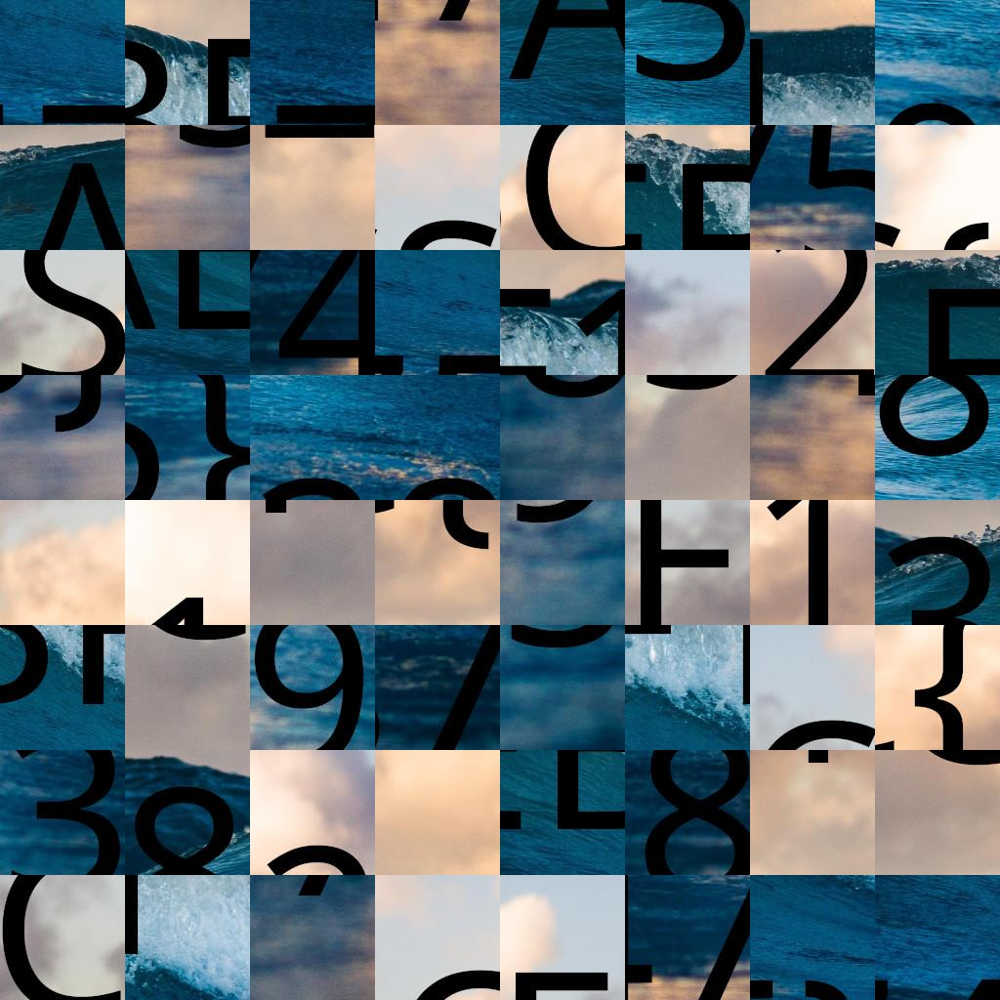

# Puzzle Trouble 1/2

## Catégorie : Misc

## Description

Le challenge consiste à remettre dans l'ordre cette image afin de pouvoir lire le flag.
Pour cela, deux méthodes :
- Faire un programme pour se simplifier certaines taches
- Le résoudre a la main sur un outil de dessins comme "paint"

Dans mon cas, la deuxième méthode a été utilisée.

### Image à remettre dans l'ordre :

